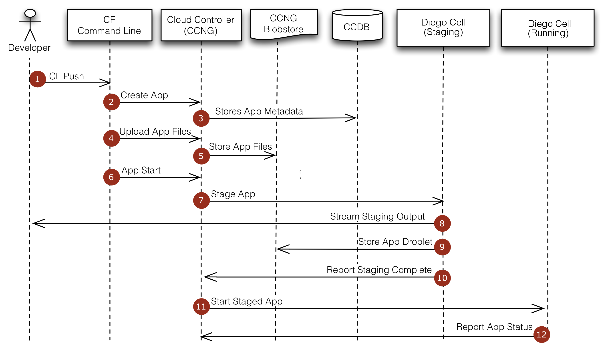

Clone the repo
https://github.com/ZancaM/DevNexus2017
The readme.md has the pre-req, and schedule

Download CF CLI

Login with user and password
```cf login -u user -p password -a endpoint -s development --skip-ssl-validation```

Cloud Foundry is a Open source Cloud Computing Platform
Designed for Fast application development and deployment

```
ARCHITECTURE:

	
 	     | App
-------------------
service | Container
-------------------
VMs
-------------------
IaaS
-------------------
Hardware 
-------------------
```


Platform Runtime (**ELASTIC runtime**) - Manages routes and api's

1. Upload App  and metadata(manifest.yml - instances, memory, names, hosts, services, environments, etc)
2. Create and bind services
3. Stage application (It will build all the dependencies for the stack using the build pack - there are Java, Node, Python, Ruby, Go, .Net Core, Static Files(ex. html) . CF will create the image container for you)
4. Deploy Application
5. Manage Application Health




Http request are routed to apps pushed by ROUTE
The router uses the subdomains to map app instances

**BLue GReen** - used to have 0 downtime
TO Read: The twelve Factors ( Best Practices to work with containers)


What about  services not present in the market place?????
You can have your own but it violates the 12 factors

Use user provided services in your CF space. More higher level of abstraction. 

cf -env (show the environment variables)


**We can customize containers** . For example turn on JMX by adding a specific env variable (not by forking the repo!). Just look at the java-buildpack cf documentation/repo https://github.com/cloudfoundry/java-buildpack


### Why Containers?
Faster/Easier Deployment
Flexibility in deployment
Better Isolation
Cost Saving

You don't have the additional os and kernel . We are not constantly bootstrapping 2 kernels and os's like in a VM.
They offer namespace isolation
Each has their Network Stack
They are governed by their own resources mgmnt


###LOGS
https://papertrailapp.com/
We can create a Log Drain service and bind it to our application to have it in our papertrailapp.com


###Other
PCF-Dev use for local development no need for an online account when it expires after 60 days
